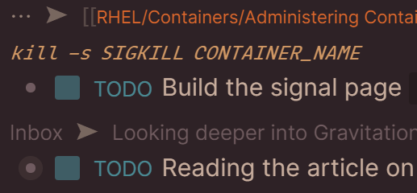
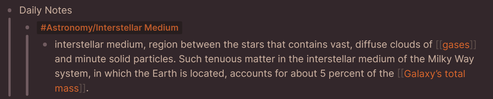

Chocolate, a delicious yummy theme. 🍫

- **Contributors:** Nick Martin (nmartin84)
- **Requires at least:** Logseq 0.5.9
- **Tested up to:** Logseq 0.5.9

## Description

A yummy delicious theme to make your Logseq a more rich experience.

**Tasks**: Use a fairly faint blue accent color to draw the user's attention, but provide a certain lightness level so that it's not over empowering.

**Breadcrumbs**: Use a smaller font-size, and reduction in brightness of the font-color so that you can focus on the important stuff, your notes.

**Page References and tags**: Use a rich color that helps draw your attention, but is not overly flashy, and uses a complementary color that fits the main colors so that it's not over empowering.

## Frequently Asked Questions

### How do I install the theme?
- Theme is available (pending PR) on the Logseq Market place!
  - Open Logseq, click on the 3 dots (...) top right corner, choose plugins, marketplace, themes.
  - Click install on the Logseq Chocolate theme.
  - Cheers. 